# Project Dependency Graph

Generated: 2026-05-23T18:46:31.390094

```mermaid
graph TD
    EJLive.Application[EJLive.Application] --> EJLive.Business[EJLive.Business]
    EJLive.Application[EJLive.Application] --> EJLive.Core[EJLive.Core]
    EJLive.Application[EJLive.Application] --> EJLive.Shared[EJLive.Shared]
    EJLive.Business[EJLive.Business] --> EJLive.Core[EJLive.Core]
    EJLive.Business[EJLive.Business] --> EJLive.Shared[EJLive.Shared]
    EJLive.Client.Service[EJLive.Client.Service] --> EJLive.Client.WinForms[EJLive.Client.WinForms]
    EJLive.Client.Service[EJLive.Client.Service] --> EJLive.Core[EJLive.Core]
    EJLive.Client.Service[EJLive.Client.Service] --> EJLive.Shared[EJLive.Shared]
    EJLive.Client.WinForms[EJLive.Client.WinForms] --> EJLive.Core[EJLive.Core]
    EJLive.Client.WinForms[EJLive.Client.WinForms] --> EJLive.Shared[EJLive.Shared]
    EJLive.Core[EJLive.Core] --> EJLive.Shared[EJLive.Shared]
    EJLive.Installer.WinForms[EJLive.Installer.WinForms] --> EJLive.Client.WinForms[EJLive.Client.WinForms]
    EJLive.Installer.WinForms[EJLive.Installer.WinForms] --> EJLive.Core[EJLive.Core]
    EJLive.Installer.WinForms[EJLive.Installer.WinForms] --> EJLive.Shared[EJLive.Shared]
    EJLive.Monitor[EJLive.Monitor] --> EJLive.Core[EJLive.Core]
    EJLive.Monitor[EJLive.Monitor] --> EJLive.Shared[EJLive.Shared]
    EJLive.Monitoring.WinForms[EJLive.Monitoring.WinForms] --> EJLive.Core[EJLive.Core]
    EJLive.Monitoring.WinForms[EJLive.Monitoring.WinForms] --> EJLive.Shared[EJLive.Shared]
    EJLive.Server.WinForms[EJLive.Server.WinForms] --> EJLive.Core[EJLive.Core]
    EJLive.Server.WinForms[EJLive.Server.WinForms] --> EJLive.Shared[EJLive.Shared]
    EJLive.Tests[EJLive.Tests] --> EJLive.Application[EJLive.Application]
    EJLive.Tests[EJLive.Tests] --> EJLive.Business[EJLive.Business]
    EJLive.Tests[EJLive.Tests] --> EJLive.Client.Service[EJLive.Client.Service]
    EJLive.Tests[EJLive.Tests] --> EJLive.Client.WinForms[EJLive.Client.WinForms]
    EJLive.Tests[EJLive.Tests] --> EJLive.Server.WinForms[EJLive.Server.WinForms]
    EJLive.Tests[EJLive.Tests] --> EJLive.Core[EJLive.Core]
    EJLive.Tests[EJLive.Tests] --> EJLive.Shared[EJLive.Shared]
    EJLive.Verification[EJLive.Verification] --> EJLive.Application[EJLive.Application]
    EJLive.Verification[EJLive.Verification] --> EJLive.Business[EJLive.Business]
    EJLive.Verification[EJLive.Verification] --> EJLive.Client.WinForms[EJLive.Client.WinForms]
    EJLive.Verification[EJLive.Verification] --> EJLive.Core[EJLive.Core]
    EJLive.Verification[EJLive.Verification] --> EJLive.Installer.WinForms[EJLive.Installer.WinForms]
    EJLive.Verification[EJLive.Verification] --> EJLive.Monitor[EJLive.Monitor]
    EJLive.Verification[EJLive.Verification] --> EJLive.Monitoring.WinForms[EJLive.Monitoring.WinForms]
    EJLive.Verification[EJLive.Verification] --> EJLive.Server.WinForms[EJLive.Server.WinForms]
    EJLive.Verification[EJLive.Verification] --> EJLive.Shared[EJLive.Shared]
```

## Package References

### EJLive.Client.Service
- Microsoft.Extensions.Hosting.WindowsServices@8.0.1

### EJLive.Client.WinForms
- System.ServiceProcess.ServiceController@9.0.1

### EJLive.Core
- System.Data.SQLite.Core@1.0.118

### EJLive.Shared
- System.Security.Cryptography.ProtectedData@8.0.0

### EJLive.Tests
- Microsoft.NET.Test.Sdk@17.14.1
- MSTest.TestAdapter@3.0.2
- MSTest.TestFramework@3.0.2

### EJLive.Verification
- System.Data.SQLite.Core@1.0.118

