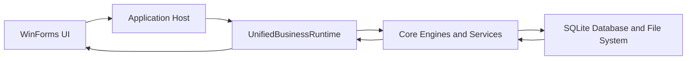

# EJLive Unified Data Flow

## Main Runtime Flow

## Functional Paths

| Path | Flow | Active components |
| --- | --- | --- |
| ATM registration | UI or host creates ATM state, Business normalizes it, Core models recalculate health, Operational store exposes summary. | `EJLiveApplicationHost`, `UnifiedBusinessRuntime`, `ATMInfo`, `OperationalStateStore` |
| Journal sync | UI or agent tracks a file, Business creates a sync record, Core tracks state and summary, alerts can be raised for failures. | `JournalSyncRecord`, `JournalSyncTrackingService`, `JournalSyncService`, `AlertManager` |
| Remote command | Server sends a command envelope, client receives it, client sends a command result, server logs the result. | `ServerEngine`, `NetworkEngine`, `RemoteCommandEnvelope`, `CommunicationProtocol` |
| File watcher | Core watcher observes an EJ file path and raises events for downstream sync or parsing. | `FileWatcherEngine` |
| Database migration | Core initializes SQLite and applies additive schema/index changes without dropping legacy fields. | `DatabaseManager` |
| UI readiness | Verification instantiates client, server, monitoring, installer, and monitor forms and checks English tab composition and control counts. | `ClientMainForm`, `ServerMainForm`, `MainDashboardForm`, `InstallerForm`, `MonitoringDashboard` |

## Database Direction

The active direction is UI to Application to Business to Core/Data and back. Direct database access from presentation code should be avoided in new promotion work; existing legacy code remains preserved until it can be adapted safely.

## Reference Data

Logs, Excel requirements, historical markdown, backup files, and ZIP study outputs remain in `legacy/original` or linked reference paths. They are not loaded at runtime by default; they document parser behavior, UI expectations, vendor coverage, and test scenarios for later staged integration.

