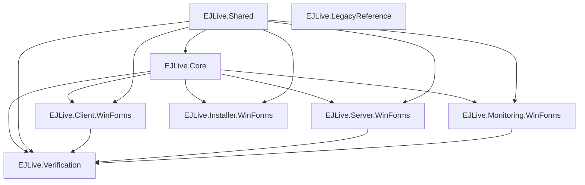
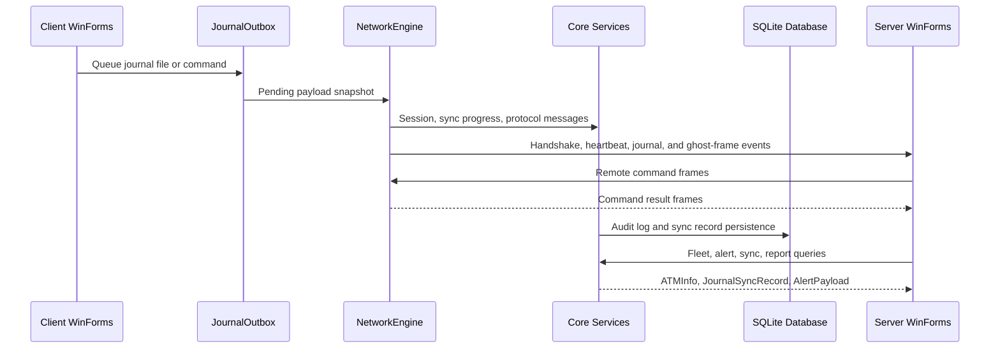

# Architecture Map

## Project Dependency Graph

## Runtime Layers

| Layer | Responsibility | Main files |
| --- | --- | --- |
| Shared | Cross-project helpers, logging, retry, crypto/hash utilities | `src/EJLive.Shared/*.cs` |
| Core Models | Canonical data contracts for ATM state, sync, alerts, commands, transactions | `src/EJLive.Core/Models/UnifiedModels.cs` |
| Core Engines | Network, protocol, outbox, file watcher, remote screen, image sync, reports, prediction, transaction analysis | `src/EJLive.Core/Engine/*.cs` |
| Core Services | SQLite access, audit, alerting, sync tracking, NCR config parsing, XFS log analysis, RBAC | `src/EJLive.Core/Services/CoreServices.cs` |
| XFS | Normalized event models and NCR/GRG/Diebold adapter surface | `src/EJLive.Core/Xfs/XfsModels.cs` |
| Client UI | ATM agent workflow: connection, journal sync, remote screen preview, remote commands, services, settings, agent XML config | `src/EJLive.Client.WinForms` |
| Server UI | Fleet, network map cards, journal viewer, sync dashboard, alerts, archive, reports, settings | `src/EJLive.Server.WinForms` |
| Monitoring UI | Operational dashboard and visual state summary | `src/EJLive.Monitoring.WinForms` |
| Installer UI | Installer/bootstrap workflow | `src/EJLive.Installer.WinForms` |
| Verification | Repeatable runtime probes for schema migration, networking, commands, file watching, and UI composition | `src/EJLive.Verification` |
| Legacy Reference | Verbatim original files for review and traceability | `src/EJLive.LegacyReference`, `legacy/original` |

## Data Flow

## Responsibility Split

- `NetworkEngine` owns socket/protocol transport and connection state.
- `JournalOutbox` owns queued journal payloads, retry state, and send lifecycle.
- `JournalSyncService` coordinates outbox queueing and progress events.
- `DatabaseManager` owns SQLite initialization, query execution, and non-query execution.
- `AlertManager` owns deduplicated runtime alerts.
- `TransactionAnalysisEngine` owns journal text parsing and transaction findings.
- `GhostRemoteEngine` owns remote screen session state and screen capture.
- WinForms projects own UI composition only and call Core services/engines.
